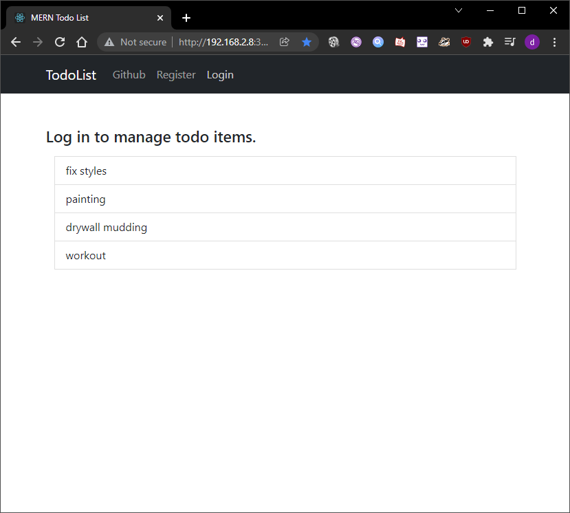
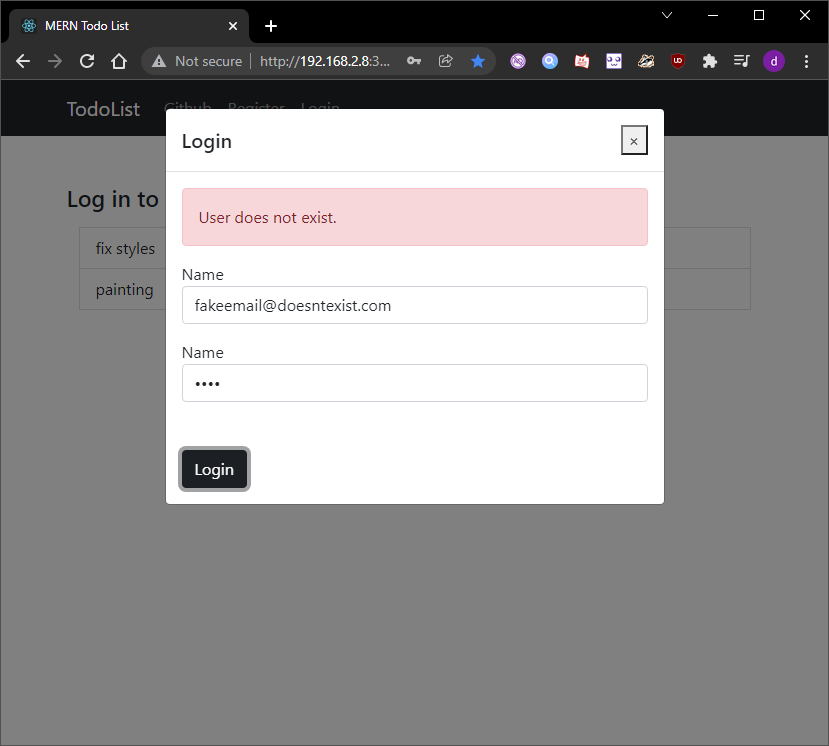
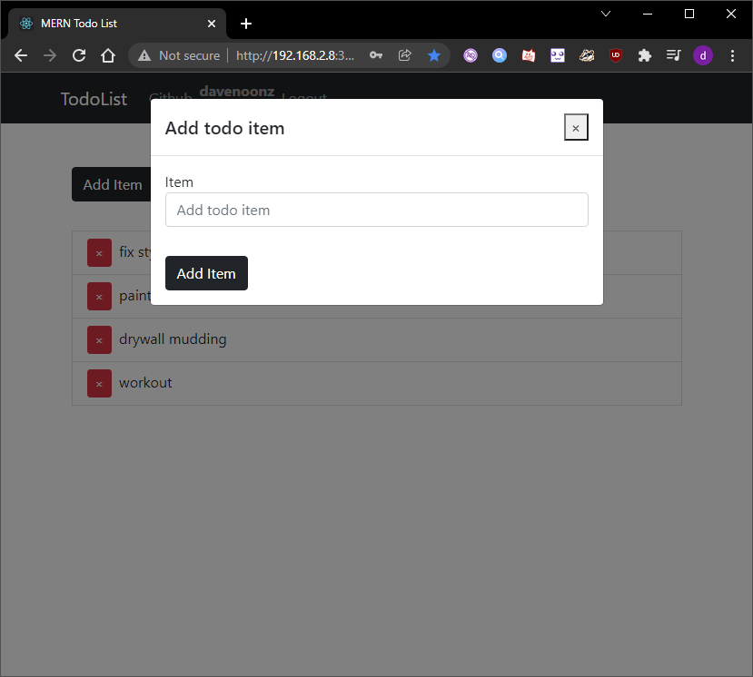

# TodoList MERN

## Overview
Basic introduction todolist web app using MERN stack with authentication on ubuntu

## Screenshots

  
  
  
  

## Credits: Dave Nunez
### Traversy Media tutorial with some slight refactoring
